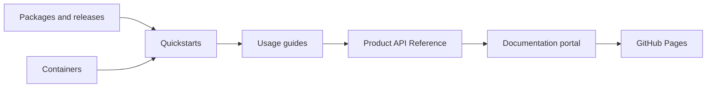

# TechIndustry Documentation

This portal centralizes usage documentation for the TechIndustry project set: industrial .NET services, TwinCAT integration, OPC UA bridge components, HMI controls, telemetry pipelines and API references.

This site is organized for people who need to install, configure and operate the components. Each library section starts from usage, then links to examples, guides and reference material.

## Documentation Model

## Main Areas

- **Getting Started**: ecosystem overview, installation, package and container consumption, runtime environment.
- **Libraries**: one first-level section per component with overview, quickstart, examples, guides and API reference.
- **Guides**: cross-project operating procedures.
- **Examples**: practical end-to-end scenarios.
