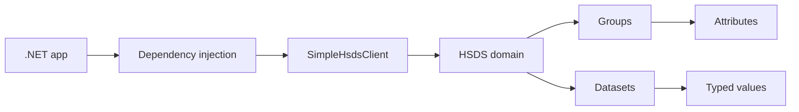

# HSDS .NET Examples

These examples show how to use `TechIndustry.Hsds` from normal .NET applications. Start from the client setup, then move to groups, attributes, datasets and background ingestion.

## Learning Path

1. [Domain and Client](./domain-and-client.md): configure the HSDS endpoint, credentials and active domain.
2. [Groups and Attributes](./groups-and-attributes.md): create a hierarchy and attach metadata to groups.
3. [Datasets and Chunks](./datasets-and-chunks.md): create compressed datasets and write/read large arrays by range.
4. [Worker Service](./worker-service.md): run HSDS writes from a hosted background process.

## Runtime Model

`SimpleHsdsClient` is the high-level entry point. It wraps the lower-level REST client and gives you domain, group, dataset, attribute and value helpers. A typical application keeps one configured instance in dependency injection and sets the active `Domain` before doing operations.

