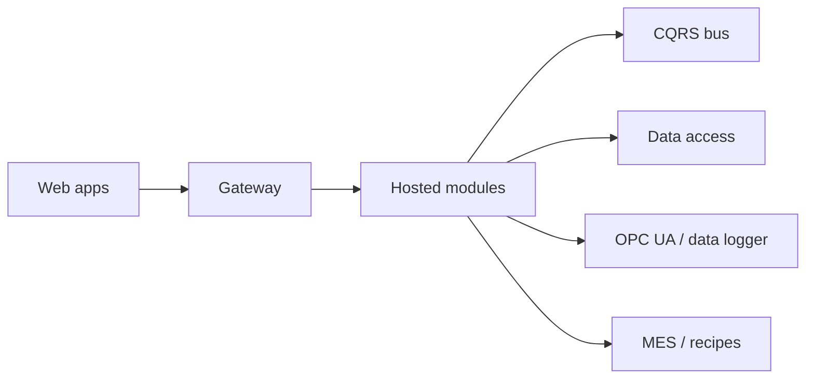

# Industria4 Platform Examples

These examples explain how to assemble and operate a platform installation using the modules and architectural patterns from the repository.

## Learning Path

1. [Local Composition](./local-composition.md): run the core services together for a local environment.
2. [Module Hosting](./module-hosting.md): load platform modules through the hosting layer.
3. [Identity Users Roles](./identity-users-roles.md): configure users, roles and authorization boundaries.
4. [CQRS Command Flow](./cqrs-command-flow.md): send commands and observe resulting events.
5. [Recipes and MES](./recipes-and-mes.md): model recipes and connect them to MES flows.
6. [OPC UA Data Logger](./opcua-data-logger.md): collect machine data from OPC UA.
7. [Production Composition](./production-composition.md): compose a production deployment.

## Platform Shape

