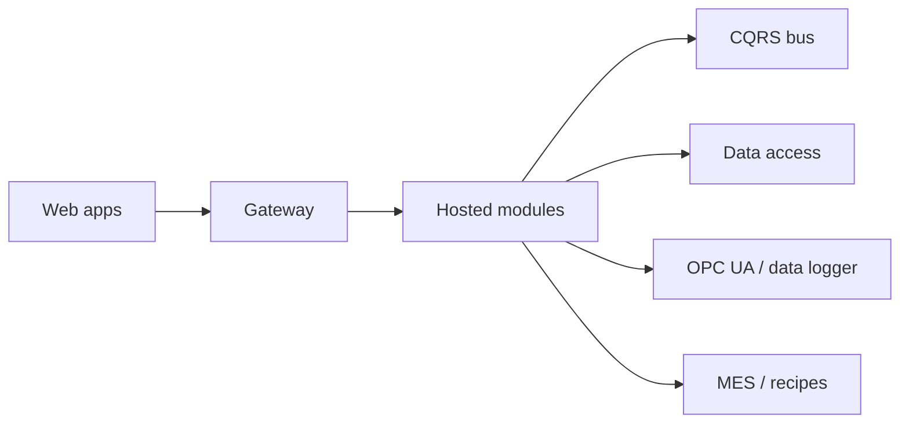

# Industria4 Platform Examples

These examples explain how to assemble and operate a platform installation using the modules and architectural patterns from the repository.

## Learning Path

1. [Local Composition](./local-composition.md): run the core services together for a local environment.
2. [Module Hosting](./module-hosting.md): load platform modules through the hosting layer.
3. [Frontend Local Hosting](./frontend-local-hosting.md): use the platform web host to test a frontend module quickly, following the Silver-style solution layout.
4. [Backend Module](./backend-module.md): create a process-hosted backend module.
5. [Frontend Module](./frontend-module.md): create a Blazor client module with menu registration.
6. [Module Definition](./module-definition.md): understand module lifecycle and when to use each module type.
7. [Module Packaging](./module-packaging.md): package backend and frontend modules with the repository `build.ps1` scripts.
8. [Dependency Injection](./dependency-injection.md): register module services through `StartupService`.
9. [Section Provider](./section-provider.md): extend frontend screens with module-provided sections.
10. [Web Forms Controls](./webforms-controls.md): use the shared Blazor Web Forms controls.
11. [Command Messaging](./command-messaging.md): define and send CQRS commands.
12. [Standardized API and OData](./standardized-api-odata.md): expose API endpoints, OData queries and typed HTTP clients.
13. [Identity Users Roles](./identity-users-roles.md): configure users, roles and authorization boundaries.
14. [CQRS Command Flow](./cqrs-command-flow.md): send commands and observe resulting events.
15. [Recipes and MES](./recipes-and-mes.md): connect selected recipes to MES work orders and OPC UA download flows.
16. [OPC UA Data Logger](./opcua-data-logger.md): collect machine data from OPC UA.
17. [Production Composition](./production-composition.md): compose a production deployment.

## Platform Shape

## Recommended Order For New Modules

When adding a new capability, create it in this order:

1. Define the backend API module and its `StartupService`.
2. Define commands, handlers and read models.
3. Expose the API with standard controllers and OData query endpoints.
4. Create the typed HTTP client.
5. Create the frontend module, dynamic routes and menu entries.
6. Package backend and frontend outputs with the module `build.ps1` scripts.
7. Add section providers only when another screen must be extended.
8. Register all services through the module `StartupService`.
