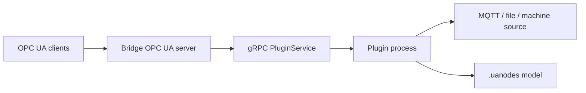

# OPC UA Bridge Examples

These examples show how to run the bridge server, attach plugin processes and expose dynamic OPC UA nodes backed by external data sources.

## Learning Path

1. [Run Server](./run-server.md): start the gRPC-enabled OPC UA server host.
2. [Echo Plugin](./echo-plugin.md): connect a plugin process with retries and `BRIDGE_URI`.
3. [Dynamic Namespace](./dynamic-namespace.md): load a `.uanodes` model into a namespace.
4. [Node Read Write](./node-read-write.md): write values into OPC UA nodes from a plugin.
5. [Write and Method Interception](./write-and-method-interception.md): approve writes/method calls and mirror values.
6. [Edge Container](./edge-container.md): run bridge and plugin as separate edge services.

## Runtime Model

The server owns the OPC UA endpoint and dynamic address space. Plugins connect over gRPC, register nodes and handle reads, writes or method calls for their namespace.
