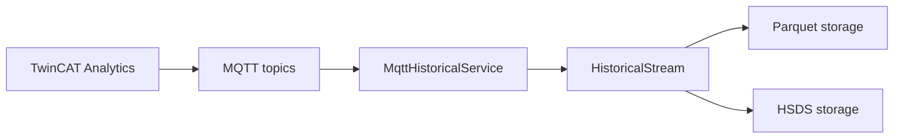

# TwinCAT Analytics Collector Examples

These examples show how to collect historical TwinCAT Analytics data from MQTT and store it in Parquet or HSDS.

## Learning Path

1. [MQTT Collector](./mqtt-collector.md): connect to TwinCAT Analytics MQTT topics.
2. [Decode and Store](./decode-and-store.md): decode historical stream messages and dispatch to storage.
3. [Parquet Storage](./parquet-storage.md): persist downloaded records as Parquet.
4. [HSDS Storage](./hsds-storage.md): persist downloaded records to HSDS datasets.
5. [Historical Download Cleanup](./historical-download-cleanup.md): download, verify and delete old recordings.

## Runtime Flow

