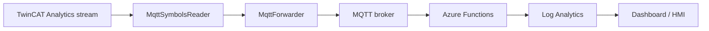

# TwinCAT Data Streaming Examples

These examples show how to stream live TwinCAT Analytics data to MQTT, Azure Functions and Log Analytics.

## Learning Path

1. [TwinCAT Symbol Reader](./twincat-symbol-reader.md): read live MQTT stream samples.
2. [MQTT Forwarder](./mqtt-forwarder.md): forward selected symbol values to MQTT topics.
3. [Azure Functions Ingestion](./azure-functions-ingestion.md): receive telemetry over HTTP or Event Hub.
4. [Log Analytics Query](./log-analytics-query.md): query collected telemetry.
5. [Realtime Dashboard](./realtime-dashboard.md): expose current values to an HMI/dashboard.
6. [Simulator To Cloud](./simulator-to-cloud.md): test the cloud pipeline without a machine.

## End To End Flow

