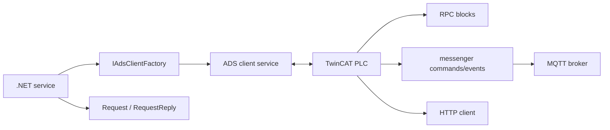

# TwinCAT Integration Examples

These examples show the complete integration surface: .NET ADS clients, PLC Structured Text request/reply blocks, PLC-side message queues, MQTT brokers, typed signals, and the sample project wiring.

## Learning Path

1. [Register Host](./register-host.md): configure ADS and register RPC services.
2. [Invoke Notifications](./invoke-notifications.md): subscribe to PLC-to-.NET invocations.
3. [Request Reply](./request-reply.md): send a request and wait for the PLC reply.
4. [Typed Payloads](./typed-payloads.md): map PLC structs and JSON payloads to .NET types.
5. [PLC Structured Text RPC](./plc-structured-text-rpc.md): implement the PLC side of requests, replies, invokes, and symbol payloads.
6. [PLC Messaging](./plc-messaging.md): route commands and events through messenger queues.
7. [PLC HTTP Client](./plc-http-client.md): call HTTP endpoints with asynchronous callbacks.
8. [PLC MQTT Client And Broker](./plc-mqtt-service-broker.md): bridge PLC messages with MQTT topics.
9. [PLC Signals And Machine State](./plc-signals-machine-state.md): model observer, typed values, signals, counters, equipment, and state transitions.
10. [PLC Sample Project](./plc-sample-project.md): understand the sample project and how to use it as a validation harness.
11. [Tester Workflow](./tester-workflow.md): configure symbols for an operator/test utility.
12. [Router Service](./router-service.md): run an ADS router when the host needs one.

## Runtime Model

Use `CreateInvoke<T>()` when the PLC notifies .NET. Use `CreateRequest<T>()` and `CreateRequestReply<T>()` when .NET asks the PLC to perform work. Use `TechIndustry.TwinCAT.IoTCore` when PLC logic also needs messenger commands/events, HTTP calls, MQTT integration, observers, typed signals, or machine-state orchestration.
