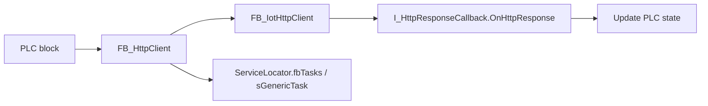

# PLC HTTP Client

## Scenario

Use `FB_HttpClient` when a TwinCAT block must call an HTTP endpoint without mixing request lifecycle, callback handling, and domain logic in the same scan body.

`FB_HttpClient` wraps Beckhoff `FB_IotHttpClient` and registers itself on `Constants.sGenericTask`. It creates `FB_HttpRequest` instances for each request, keeps them alive while the Beckhoff request is busy, calls `I_HttpResponseCallback.OnHttpResponse()` when the response is ready, and deletes the request wrapper afterwards.

## Pattern



The important rule is that the caller starts a request and then returns to the PLC cycle. The response is handled asynchronously by the callback when the generic task observes that the request is no longer busy.

## Minimal GET Client

This is the same pattern used by the sample `FB_IssNow`.

```pascal title="FB_IssNow declaration"
FUNCTION_BLOCK FB_IssNow IMPLEMENTS I_HttpResponseCallback
VAR
    uTimestamp       : UDINT;
    fbHttHeaders     : FB_IotHttpHeaderFieldMap;

    // Beckhoff HTTP client: host, keep-alive and connection timeout live here.
    fbHttpClient     : FB_IotHttpClient := (
        sHostName := 'api.open-notify.org',
        bKeepAlive := TRUE,
        tConnectionTimeout := T#3S);

    // TechIndustry wrapper: it owns request objects and calls this block back.
    fbJsonHttpClient : FB_HttpClient(
        fbIotHttpClient := ADR(fbHttpClient),
        ipCallback := THIS^);

    // Prevents a new request while the previous response is still pending.
    bRequesting : BOOL;

    // Simple polling interval for the external endpoint.
    fbTimer : TON := (PT := T#2000MS);
END_VAR
```

```pascal title="FB_IssNow cyclic body"
// Wait until the current request has completed and the client is configured.
fbTimer(IN := NOT bRequesting AND fbHttpClient.bConfigured);

IF NOT fbHttpClient.bConfigured THEN
    // BaseUri is prepended by FB_HttpClient.Get().
    fbJsonHttpClient.BaseUri := '/';

    // The sample endpoint uses HTTP.
    fbHttpClient.nHostPort := 80;
END_IF

IF fbHttpClient.bConfigured AND fbTimer.Q THEN
    bRequesting := TRUE;

    // The request object is allocated internally and tracked until completion.
    fbJsonHttpClient.Get('/iss-now.json', fbHttHeaders);
END_IF
```

```pascal title="FB_IssNow.OnHttpResponse"
METHOD OnHttpResponse
VAR_INPUT
    ipFbHttpRequest : POINTER TO FB_IotHttpRequest;
END_VAR
VAR
    fbJson  : FB_JsonDomParser;
    jsonVal : SJsonValue;
    jsonDoc : SJsonValue;
    pContent : STRING(200);
END_VAR

// Allow the next timer cycle to start another request.
bRequesting := FALSE;

IF ipFbHttpRequest^.nStatusCode >= 200 AND ipFbHttpRequest^.nStatusCode < 300 THEN
    // JSON responses can be parsed directly from the Beckhoff request object.
    jsonDoc := ipFbHttpRequest^.GetJsonDomContent(fbJson);

    IF fbJson.HasMember(jsonDoc, 'timestamp') THEN
        jsonVal := fbJson.FindMember(jsonDoc, 'timestamp');
        uTimestamp := fbJson.GetUint(jsonVal);
    END_IF
ELSE
    // Always read the response body on errors; it is usually the only useful detail.
    ipFbHttpRequest^.GetContent(ADR(pContent), SIZEOF(pContent), TRUE);
    ADSLOGSTR(ADSLOG_MSGTYPE_ERROR, pContent, '');
END_IF
```

## POST With Payload

Use `Post()` when the PLC needs to send JSON, metrics, or command acknowledgements to an external service.

```pascal title="POST request"
VAR
    sPayload : STRING(1024);
    fbHeaders : FB_IotHttpHeaderFieldMap;
END_VAR

// Build the payload in a local buffer that remains valid during the call.
sPayload := '{"device":"press-01","state":"ready"}';

IF fbJsonHttpClient.Ready THEN
    fbJsonHttpClient.Post(
        sUri := '/api/machine-state',
        pContent := ADR(sPayload),
        nContentSize := LEN2(ADR(sPayload)),
        fbHeader := fbHeaders);
END_IF
```

## Running The Client

`FB_HttpClient` registers itself as an `I_Task`, so the PLC must run `sGenericTask`.

```pascal title="MAIN or EVENTS"
// This executes FB_HttpClient.Run(), which executes FB_IotHttpClient
// and dispatches finished requests to OnHttpResponse().
ServiceLocator.fbTasks.Run(TechIndustry_TwinCAT_IoTCore.Constants.sGenericTask);
```

## Cancellation

Call `Cancel()` when the machine state changes and pending responses should be ignored.

```pascal title="Cancel pending HTTP callbacks"
IF bAbortExternalCall THEN
    // Existing Beckhoff requests may still complete, but the wrapper will not call the callback.
    fbJsonHttpClient.Cancel();
END_IF
```

## Production Checklist

1. Configure `FB_IotHttpClient` host, port, TLS and timeout before sending requests.
2. Use one boolean guard such as `bRequesting` per polling request.
3. Keep request payload buffers valid for the call.
4. Parse HTTP status codes in `OnHttpResponse()`.
5. Run `Constants.sGenericTask`; otherwise requests will not progress.
6. Cancel pending requests when the caller is no longer interested in the response.
