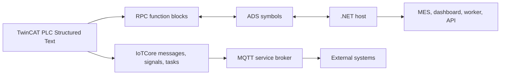

# TwinCAT Integration

TwinCAT Integration is the integration layer between Beckhoff TwinCAT PLC code and .NET services. It covers ADS/RPC communication, request/reply handshakes, PLC-to-.NET notifications, PLC-side message queues, MQTT service brokers, typed signals, and machine-state primitives.

## Repository

`TechIndustryX/twincat-integration`

## What It Contains

- `TechIndustry.Rpc.TwinCAT`: .NET library for ADS connectivity, invoke notifications, request/reply calls, typed payloads, and optional ADS router registration.
- `TechIndustry.TwinCAT.Rpc`: TwinCAT Structured Text function blocks for `Invoke`, `Request`, and `RequestReply` flows, including typed, binary-symbol, and JSON-symbol variants.
- `TechIndustry.TwinCAT.IoTCore`: PLC-side primitives for messages, listeners, task queues, MQTT service brokers, typed `ST_Value` signals, reactive subjects, and machine-state objects.
- `TechIndustry.TwinCAT.Samples`: sample PLC project that shows machines, order requests, JSON payloads, signal updates, MES-style MQTT messages, and command handling.

## Runtime Model

## When To Use It

Use TwinCAT Integration when a PLC program must expose explicit operations instead of raw variable polling:

- the PLC publishes events to a .NET service;
- a .NET service asks the PLC to execute a command and waits for completion;
- a .NET service requests a typed reply such as a status, string, struct, or JSON object;
- PLC logic needs a message bus, task queues, typed signals, or MQTT-based integration;
- a sample TwinCAT project is needed to validate ADS symbols before connecting a production machine.

## Naming

The repository is named `twincat-integration` because it contains more than RPC wrappers. The NuGet package remains `TechIndustry.Rpc.TwinCAT`, and the PLC libraries keep their existing TwinCAT project names.
