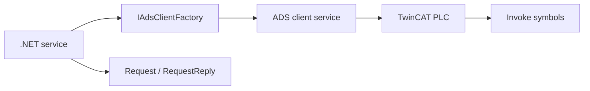

# TwinCAT RPC Examples

These examples show how to call PLC function blocks from .NET and how to receive PLC notifications with ADS.

## Learning Path

1. [Register Host](./register-host.md): configure ADS and register RPC services.
2. [Invoke Notifications](./invoke-notifications.md): subscribe to PLC-to-.NET invocations.
3. [Request Reply](./request-reply.md): send a request and wait for the PLC reply.
4. [Typed Payloads](./typed-payloads.md): map PLC structs and JSON payloads to .NET types.
5. [Tester Workflow](./tester-workflow.md): configure symbols for an operator/test utility.
6. [Router Service](./router-service.md): run an ADS router when the host needs one.

## Runtime Model

Use `CreateInvoke<T>()` when the PLC notifies .NET. Use `CreateRequest<T>()` and `CreateRequestReply<T>()` when .NET asks the PLC to perform work.
